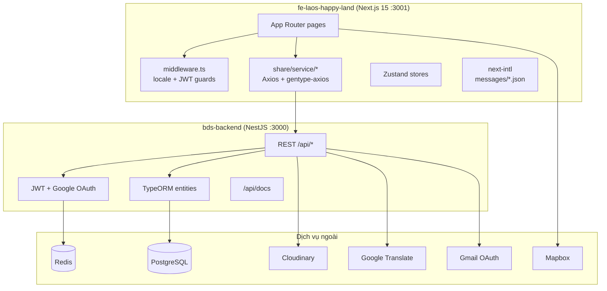

# Laos Happy Land — Tài liệu dự án chi tiết

> Nền tảng bất động sản (BĐS) đa ngôn ngữ dành cho thị trường Lào — **Laohappyland.com**.
> Dự án gồm hai phần độc lập: **Frontend (Next.js 15)** và **Backend (NestJS 10 REST API)**.

---

## Mục lục

1. [Tổng quan](#1-tổng-quan)
2. [Cấu trúc thư mục](#2-cấu-trúc-thư-mục)
3. [Công nghệ sử dụng](#3-công-nghệ-sử-dụng)
4. [Frontend — fe-laos-happy-land](#4-frontend--fe-laos-happy-land)
5. [Backend — bds-backend](#5-backend--bds-backend)
6. [Cơ sở dữ liệu & các Entity](#6-cơ-sở-dữ-liệu--các-entity)
7. [Xác thực & Phân quyền](#7-xác-thực--phân-quyền)
8. [API Endpoints](#8-api-endpoints)
9. [Đa ngôn ngữ (i18n) & Đa tiền tệ](#9-đa-ngôn-ngữ-i18n--đa-tiền-tệ)
10. [Biến môi trường](#10-biến-môi-trường)
11. [Hướng dẫn cài đặt & chạy](#11-hướng-dẫn-cài-đặt--chạy)
12. [Quy trình nghiệp vụ chính](#12-quy-trình-nghiệp-vụ-chính)
13. [Triển khai (Deployment)](#13-triển-khai-deployment)
14. [Ghi chú & điểm cần lưu ý](#14-ghi-chú--điểm-cần-lưu-ý)

---

## 1. Tổng quan

**Laos Happy Land** là một sàn giao dịch bất động sản trực tuyến đa ngôn ngữ phục vụ thị trường Lào. Hệ thống cho phép:

- Đăng tin **mua bán / cho thuê / dự án** bất động sản.
- Danh bạ **môi giới (broker)** với hồ sơ, đánh giá, chuyên môn.
- **Tin tức** bất động sản theo chuyên mục.
- **Công cụ tính khoản vay** (loan calculator).
- **Đối tác ngân hàng** và gửi yêu cầu hợp tác.
- Hệ thống **quản trị (Admin CMS)** đầy đủ.

### Kiến trúc tổng thể

```
Laos-happy-land/
├── bds-backend/          # API NestJS (cổng 3000)
└── fe-laos-happy-land/   # Web Next.js (cổng 3001)
```

Đây là một **monorepo không dùng workspace tooling** — frontend và backend là hai dự án độc lập, không có `package.json` ở thư mục gốc, chạy riêng biệt. Frontend giao tiếp trực tiếp với backend qua **Axios** (sử dụng type được sinh tự động từ Swagger).



---

## 2. Cấu trúc thư mục

### Thư mục gốc

```
Laos-happy-land/
├── .git/
├── bds-backend/          # Backend NestJS
└── fe-laos-happy-land/   # Frontend Next.js
```

### Frontend — `fe-laos-happy-land/`

| Đường dẫn | Mục đích |
|-----------|----------|
| `build/Dockerfile` | Docker image cho production (pnpm, cổng 3001) |
| `messages/` | File dịch i18n: `en.json`, `vn.json`, `la.json` (~1.700 dòng mỗi file) |
| `middleware.ts` | Định tuyến locale + bảo vệ route bằng JWT cookie |
| `next.config.js` | Cấu hình Next.js + plugin next-intl, domain ảnh |
| `postcss.config.js` | Plugin Tailwind CSS v4 |
| `prettier.config.mjs` | Prettier + plugin Tailwind |
| `eslint.config.js` | Cấu hình ESLint (flat config) |
| `public/` | Tài nguyên tĩnh: logo, ảnh nền auth, icon admin, ảnh landing, `manifest.json` |
| `src/@types/` | `gentype-axios.ts` (client API sinh từ Swagger), `types.ts` (kiểu domain) |
| `src/app/` | Các trang theo App Router |
| `src/components/` | Component UI (layout, business, common) |
| `src/i18n.ts` | Cấu hình next-intl phía server |
| `src/share/` | Config, hằng số, helper, hook, service, store, style, util dùng chung |
| `src/utils/locale.ts` | Hook lấy locale từ URL |
| `swagger-typescript-api.config.ts` | Cấu hình sinh type API |

### Backend — `bds-backend/`

| Đường dẫn | Mục đích |
|-----------|----------|
| `build/Dockerfile` | Docker image cho production (yarn, cổng 3000) |
| `src/main.ts` | Bootstrap, CORS, prefix toàn cục `api`, Swagger |
| `src/app.module.ts` | Module gốc, nối tất cả feature modules |
| `src/common/` | DB module, DTO dùng chung, abstract entity, enum |
| `src/entities/` | Định nghĩa entity TypeORM (13 entity domain) |
| `src/modules/` | Các feature module (auth, property, user, news, ...) |
| `src/service/` | Service dùng chung: Cloudinary, Google Translate |
| `src/scripts/migrate-translations.ts` | Script migrate bản dịch (chạy một lần) |
| `test/` | E2E test scaffold |

---

## 3. Công nghệ sử dụng

### Frontend

| Hạng mục | Công nghệ |
|----------|-----------|
| Framework | Next.js 15 (App Router) |
| UI Library | React 19 |
| Component Library | Ant Design 5 |
| Styling | Tailwind CSS v4 |
| State Management | Zustand |
| Form | React Hook Form + Zod |
| HTTP Client | Axios (type sinh từ Swagger) |
| i18n | next-intl v4 |
| Bản đồ | Mapbox GL + react-map-gl |
| Biểu đồ | Recharts |
| Icon | Lucide React, React Icons |
| Hooks tiện ích | ahooks |
| Package Manager | pnpm 9.15.4 |
| Khởi tạo từ | T3 Stack template |

### Backend

| Hạng mục | Công nghệ |
|----------|-----------|
| Framework | NestJS 10 |
| ORM | TypeORM 0.3 |
| Database | PostgreSQL (`pg`) |
| Xác thực | JWT + Passport (Google OAuth20) |
| Cache | Redis (cache-manager) |
| Lưu trữ ảnh | Cloudinary + Sharp |
| Gửi email | Nodemailer + Gmail OAuth |
| Dịch tự động | Google Cloud Translate |
| API Docs | Swagger |
| Package Manager | yarn |

---

## 4. Frontend — `fe-laos-happy-land`

### 4.1. Luồng khởi động

```
src/app/layout.tsx          → HTML gốc, font, Ant Design, next-intl, AuthProvider
src/app/page.tsx            → Redirect tới /{locale}
middleware.ts               → Thêm prefix locale + bảo vệ route
src/app/[locale]/layout.tsx → Kiểm tra locale, load messages
```

### 4.2. Các nhóm route trong `src/app/[locale]/`

| Nhóm | Layout | Mô tả |
|------|--------|-------|
| `(main)` | `MainLayout` (header/footer) | Trang công khai + người dùng |
| `(auth)` | Layout tối giản | login, register, reset-password, unauthorized |
| `(admin)` | `AdminLayout` (sidebar) | Trang quản trị CMS |

**Route legacy không locale** (được middleware redirect): `/privacy`, `/terms`
**Các file app khác:** `robots.ts`, `viewport.ts`, `not-found.tsx`

### 4.3. Trang công khai/người dùng — `(main)/`

| Route | Mục đích |
|-------|----------|
| `/` | Trang chủ / landing |
| `/properties-for-sale` | Danh sách BĐS bán |
| `/properties-for-rent` | Danh sách BĐS cho thuê |
| `/properties-for-project` | Danh sách dự án |
| `/property/[id]` | Chi tiết BĐS |
| `/create-property` | Người dùng tạo tin |
| `/edit-property/[id]` | Sửa tin |
| `/project` | Trang dự án |
| `/news`, `/news/[id]` | Danh sách & chi tiết tin tức |
| `/brokers`, `/brokers/[id]` | Danh bạ & hồ sơ môi giới |
| `/about` | Giới thiệu |
| `/loan-calculator` | Công cụ tính khoản vay |
| `/bank-request` | Yêu cầu hợp tác ngân hàng |
| `/dashboard` | Bảng điều khiển người dùng |
| `/profile` | Hồ sơ người dùng |
| `/terms`, `/privacy` | Trang pháp lý |
| `/google-callback` | Xử lý token Google OAuth |

### 4.4. Trang quản trị — `(admin)/admin/`

| Route | Mục đích |
|-------|----------|
| `/admin` | Dashboard quản trị |
| `/admin/users` | Quản lý người dùng |
| `/admin/requests` | Yêu cầu nâng cấp vai trò / ngân hàng |
| `/admin/property-types` | CRUD loại BĐS |
| `/admin/properties`, `.../create`, `.../[id]` | Quản lý BĐS |
| `/admin/location-info` | Quản lý khu vực / vị trí |
| `/admin/news-types` | CRUD chuyên mục tin |
| `/admin/news` | CRUD tin tức |
| `/admin/banks` | CRUD ngân hàng |
| `/admin/exchange-rates` | Tỷ giá hối đoái |
| `/admin/settings` | Cấu hình site (banner, hotline, ...) |
| `/admin/profile` | Hồ sơ admin |

### 4.5. Components — `src/components/`

**`layout/`** — `main-layout.tsx`, `admin-layout.tsx`, `header/`, `footer/`, `sidebar/`

**`business/`**
- `landing/` — Trang chủ, tìm kiếm, danh sách BĐS, tin tức, môi giới, dự án, điều khoản, bảo mật
- `property-details/` — Gallery ảnh, chi tiết, biểu đồ lịch sử giá (Recharts)
- `auth/` — Login, register, reset-password, nút đăng nhập Google
- `admin/` — Giao diện CRUD đầy đủ với modal cho từng entity
- `user/` — Dashboard, profile, tạo/sửa BĐS, about
- `common/` — Thẻ BĐS, bản đồ Mapbox/modal, chuyển ngôn ngữ/tiền tệ, project builder
- `loan-calculator/` — Component tính khoản vay

**`common/`** — `auth-provider.tsx`, `loading-screen.tsx`, `token-handler.tsx`, `i18n-provider.tsx`

### 4.6. Thư mục dùng chung — `src/share/`

| Thư mục con | File | Mục đích |
|-------------|------|----------|
| `config/` | `antd.config.tsx`, `antd-styles.ts`, `theme.config.ts` | Theme Ant Design |
| `constant/` | `admin-nav-constant.ts`, `home-search.ts` | Nav admin, hằng số tìm kiếm |
| `helper/` | `format-date.ts`, `format-location.ts`, `locale.helper.ts`, `metadata.helper.ts`, `number-to-string.ts` | Định dạng & ánh xạ locale |
| `hook/` | `useLoading.ts`, `useUserRoles.ts` | Custom hooks |
| `service/` | 15 file service | Wrapper Axios theo từng domain API |
| `store/` | `auth.store.ts`, `currency.store.ts`, `locale.store.ts` | Zustand stores |
| `styles/` | `globals.css` | Tailwind v4 + biến CSS |
| `util/` | `debounce.ts` | Tiện ích |

**Danh sách service:** `api.service.ts`, `auth.service.ts`, `property.service.ts`, `user.service.ts`, `news.service.ts`, `news-type.service.ts`, `bank.service.ts`, `bank-request.service.ts`, `exchange-rate.service.ts`, `location-info.service.ts`, `setting.service.ts`, `dashboard.service.ts`, `upload.service.ts`, `user-feedback.service.ts`

### 4.7. Quản lý trạng thái (State Management)

Dùng **Zustand** trong `src/share/store/`:

| Store | Lưu trữ | Mục đích |
|-------|---------|----------|
| `auth.store.ts` | Không | User, isAuthenticated, login/logout/Google callback |
| `currency.store.ts` | localStorage (`currency-storage`) | Tiền tệ hiển thị: USD, LAK, THB |
| `locale.store.ts` | localStorage (`locale-storage`) | Ngôn ngữ UI ưa thích |

Ngoài ra: `ahooks` (hook tiện ích), URL search params (trạng thái filter ở trang danh sách), React Hook Form (trạng thái form).

> Lưu ý: Dự án **không dùng** Redux, React Query hay SWR — dữ liệu được lấy qua tầng service + state ở mức component.

### 4.8. Styling

| Tầng | Công nghệ |
|------|-----------|
| Chính | Tailwind CSS v4 (`@import "tailwindcss"` trong `globals.css`) |
| Design tokens | Khối `@theme` CSS (đỏ chủ đạo `#dc2626`, xanh phụ, xanh lá nhấn) |
| Component library | Ant Design 5 (`ConfigProvider` với token tùy chỉnh) |
| Icon | Lucide React, React Icons |
| Font | Be Vietnam Pro (Google Fonts) |
| Bản đồ | Mapbox GL + react-map-gl |

### 4.9. Scripts (package.json)

| Script | Lệnh |
|--------|------|
| `dev` | `next dev --turbo -p 3001` |
| `build` | `next build` |
| `start` | `next start -p 3001` |
| `preview` | `next build && next start -p 3001` |
| `lint` / `lint:fix` | `next lint` / `next lint --fix` |
| `check` | `next lint && tsc --noEmit` |
| `typecheck` | `tsc --noEmit` |
| `format:check` / `format:write` | Prettier |
| `gen-api-types` | `swagger-typescript-api-es` (sinh type API từ Swagger) |

---

## 5. Backend — `bds-backend`

### 5.1. Luồng khởi động

```
src/main.ts       → NestFactory, CORS, prefix "api", Swagger tại /api/docs
src/app.module.ts → Import tất cả feature modules, cấu hình DataSource cho Property
```

> Backend **không có** API route trong Next.js — frontend gọi trực tiếp NestJS qua Axios.

### 5.2. Cấu hình chính

- **Prefix toàn cục:** `/api`
- **Swagger UI:** `/api/docs`
- **OpenAPI JSON:** `/api/docs-json`
- **CORS:** được bật trong `main.ts`

### 5.3. Service dùng chung — `src/service/`

- **Cloudinary** — upload và quản lý ảnh.
- **Google Translate** — dịch tự động nội dung sang `en`, `lo`, `vi`.

### 5.4. Email Templates (Handlebars)

Trong `bds-backend/src/modules/send-mail/templates/`:
- `contact.hbs` — email liên hệ
- `layout.hbs` — layout chung
- `new-post.hbs` — thông báo tin mới

### 5.5. Scripts (package.json)

`build`, `start`, `start:dev`, `start:debug`, `start:prod`, `lint`, `test`, `test:watch`, `test:cov`, `test:e2e`, `format`

---

## 6. Cơ sở dữ liệu & các Entity

**ORM:** TypeORM 0.3 + PostgreSQL
**Cấu hình:** `bds-backend/src/common/db/db.module.ts`
- `synchronize: true` (tự đồng bộ schema — tiện cho dev, **rủi ro với production**)
- SSL bật với `rejectUnauthorized: false`
- Entity nạp từ `src/entities/*`

> Dự án **không dùng** Prisma/Drizzle và **không có** thư mục migrations — schema được điều khiển bằng entity với auto-sync.

### 6.1. Các Entity (đều kế thừa `AbstractEntity` với trường audit)

| Entity | Bảng | Trường chính |
|--------|------|--------------|
| `User` | `users` | fullName, email, phone, mật khẩu băm, role, locationInfo, trường broker (kinh nghiệm, rating, chuyên môn), roleRequests (JSON) |
| `UserRole` | `user_role` | name (Admin, User, Broker, ...) |
| `Property` | `properties` | code (tự tăng), owner, type, title, description, price (JSONB đa tiền tệ), priceHistory, details, location (JSONB), images, status, transactionType, translatedContent |
| `PropertyType` | `property_types` | name, transactionType, translatedContent |
| `LocationInfo` | `location_infos` | name, imageURL, districts (mảng), viewCount |
| `News` | `news` | title, details (JSONB), type, viewCount, translatedContent |
| `NewsType` | `news_types` | name, translatedContent |
| `Bank` | (mặc định) | name, imageUrl, termRates (JSON), translatedContent |
| `BankRequest` | `bank_requests` | fullName, email, phone, status, quan hệ bank |
| `ExchangeRate` | `exchange_rates` | currency, rate (numeric) |
| `Setting` | `settings` | images, banner, description, hotline, facebook |
| `AboutUs` | `about_us` | title, content (JSONB) |
| `UserFeedback` | `user_feedbacks` | user, reviewer, rating, comment |

### 6.2. Enum — `src/common/enum/enum.ts`

| Enum | Giá trị |
|------|---------|
| `RoleEnum` | admin, user, agent |
| `TransactionEnum` | rent, sale, project |
| `PropertyStatusEnum` | pending, approved, rejected |
| `BankRequestStatus` | pending, approved, rejected |

### 6.3. Mẫu lưu bản dịch

Hầu hết entity lưu trường `translatedContent` dạng JSONB với key `en`, `lo`, `vi`. Backend dùng Google Translate API + script migrate để điền dữ liệu.

---

## 7. Xác thực & Phân quyền

### 7.1. Backend — `bds-backend/src/modules/auth/`

| Cơ chế | Chi tiết |
|--------|----------|
| **Email/mật khẩu** | PBKDF2-SHA512 với salt ngẫu nhiên (định dạng `hash.salt`) |
| **JWT** | Access token (7 ngày, `JWT_LOGIN_SECRET`) + refresh token (`JWT_REFRESH_SECRET`) |
| **Google OAuth** | Passport Google OAuth20 → redirect về `FRONTEND_URL?token={access_token}` |
| **Reset mật khẩu** | Mã 6 chữ số cache trong Redis, gửi qua email (Nodemailer + Gmail OAuth) |
| **Guards** | `AuthGuard`, `OptionalAuthGuard`, `AdminGuard` (yêu cầu role `Admin`) |

**Endpoints auth** (prefix `/api/auth`):
- `POST register`, `POST login`, `POST refresh`
- `GET google/login`, `GET google/redirect`
- `POST send-reset-code`, `POST verify-reset-code`, `POST reset-password-with-code`

### 7.2. Frontend

- **JWT tự quản lý** (không dùng NextAuth dù có dependency).
- Token lưu ở `localStorage` + cookie `access_token` (cho middleware).
- `middleware.ts` giải mã JWT từ cookie để bảo vệ route.
- `AuthProvider` + `useAuthStore` (Zustand) khởi tạo auth ở client.
- `TokenHandler` xử lý `?token=` từ redirect Google OAuth.
- Route admin yêu cầu `role === "admin"` (không phân biệt hoa thường ở middleware; backend dùng `"Admin"`).

---

## 8. API Endpoints

**Prefix toàn cục:** `/api` · **Swagger UI:** `/api/docs` · **OpenAPI JSON:** `/api/docs-json`

| Controller | Base path | Endpoint chính |
|------------|-----------|----------------|
| Auth | `/api/auth` | register, login, refresh, Google OAuth, reset mật khẩu |
| User | `/api/user` | CRUD, gửi/duyệt yêu cầu nâng cấp vai trò |
| UserRole | `/api/user-role` | CRUD |
| Property | `/api/property` | CRUD, filter, tin của owner, approve/reject, increment-view, similar |
| PropertyType | `/api/property-type` | CRUD |
| LocationInfo | `/api/location-info` | CRUD, trending |
| News | `/api/news` | CRUD |
| NewsType | `/api/news-type` | CRUD |
| Bank | `/api/bank` | CRUD |
| BankRequest | `/api/bank-request` | CRUD, approve/reject |
| ExchangeRate | `/api/exchange-rate` | CRUD |
| Setting | `/api/setting` | GET, PATCH |
| AboutUs | `/api/about-us` | GET, PATCH |
| UserFeedback | `/api/user-feedback` | POST, GET theo user |
| Dashboard | `/api/dashboard` | GET thống kê |
| Image | `/api/images` | POST upload (Cloudinary) |
| SendMail | `/api/send-mail` | test, new-post-notification, contact |

**Client API frontend:** File `gentype-axios.ts` (~2.300 dòng) sinh tự động, dùng qua `api.service.ts` với Axios interceptors thêm header `Authorization`, `lang`, `currency`, và `priceSource`.

---

## 9. Đa ngôn ngữ (i18n) & Đa tiền tệ

### 9.1. Đa ngôn ngữ — next-intl v4

| Cấu hình | Giá trị |
|----------|---------|
| Locales | `en`, `vn`, `la` |
| Mặc định | `la` (trong middleware & i18n.ts) |
| Locale prefix | Luôn có (`localePrefix: "always"`) |
| Messages | `/messages/en.json`, `vn.json`, `la.json` |
| Múi giờ | `Asia/Vientiane` |

**Namespace messages:** `about`, `admin`, `auth`, `bankRequest`, `broker`, `common`, `currency`, `errors`, `footer`, `home`, `loanCalculator`, `map`, `metadata`, `navigation`, `news`, `privacy`, `property`, `search`, `terms`, ...

**i18n phía backend:** API nhận header `lang` và `priceSource` (ánh xạ từ locale qua `locale.helper.ts`). Entity trả về `translatedContent` theo ngôn ngữ. Google Cloud Translate dùng để dịch tự động.

### 9.2. Đa tiền tệ

- BĐS lưu giá dạng JSONB hỗ trợ nhiều tiền tệ.
- Entity `ExchangeRate` quản lý tỷ giá để quy đổi hiển thị.
- Người dùng chọn tiền tệ hiển thị (USD / LAK / THB) qua Zustand store `currency.store.ts`.

---

## 10. Biến môi trường

### Frontend — `fe-laos-happy-land/.env`

| Biến | Mục đích |
|------|----------|
| `NEXT_PUBLIC_API_URL` | URL gốc backend |
| `API_URL` | URL Swagger JSON để sinh type |
| `NEXT_PUBLIC_MAPBOX_TOKEN` | Token bản đồ Mapbox |
| `NODE_ENV` | Môi trường |
| `NEXT_PUBLIC_BASE_URL` | Dùng trong metadata |
| `SKIP_ENV_VALIDATION` | Bỏ qua validate env |
| `PORT` | 3001 (đặt trong next.config) |

### Backend — `bds-backend/.env`

| Biến | Mục đích |
|------|----------|
| `PORT` | Cổng server (mặc định 3000) |
| `NODE_ENV` | Môi trường |
| `DB_HOST`, `DB_PORT`, `DB_DATABASE`, `DB_USER`, `DB_PASSWORD` | PostgreSQL |
| `JWT_LOGIN_SECRET`, `JWT_REFRESH_SECRET` | Ký JWT |
| `GOOGLE_CLIENT_ID`, `GOOGLE_CLIENT_SECRET` | Đăng nhập Google OAuth |
| `GOOGLE_OAUTH_REFRESH_TOKEN`, `GOOGLE_OAUTH_REDIRECT_URI` | Gửi email qua Gmail OAuth |
| `GOOGLE_TRANSLATE_API_KEY` | Dịch tự động |
| `CLOUDINARY_NAME`, `CLOUDINARY_API_KEY`, `CLOUDINARY_API_SECRET` | Upload ảnh |
| `FRONTEND_URL` | Đích redirect OAuth |
| `API_URL` | Callback URL Google OAuth |
| `REDIS_HOST`, `REDIS_PORT`, `REDIS_URL` | Cache mã reset mật khẩu |
| `MAIL_FROM_NAME`, `MAIL_FROM_EMAIL` | Người gửi email |

> ⚠️ **Cảnh báo bảo mật:** Cả hai file `.env` đang chứa thông tin nhạy cảm/secret thật được commit vào repo. Nên **xoay (rotate) lại toàn bộ secret** và dùng file mẫu `.env.example` thay thế.

---

## 11. Hướng dẫn cài đặt & chạy

### Backend

```bash
cd bds-backend
yarn install
# Tạo file .env với các biến ở mục 10
yarn start:dev        # Chạy dev (cổng 3000)
```

- API: `http://localhost:3000/api`
- Swagger: `http://localhost:3000/api/docs`

### Frontend

```bash
cd fe-laos-happy-land
pnpm install
# Tạo file .env với các biến ở mục 10
pnpm dev              # Chạy dev (cổng 3001, turbo)
```

- Web: `http://localhost:3001`

### Sinh lại type API (khi backend thay đổi)

```bash
cd fe-laos-happy-land
pnpm gen-api-types    # Đọc Swagger JSON từ API_URL → src/@types/gentype-axios.ts
```

---

## 12. Quy trình nghiệp vụ chính

1. **Đăng tin BĐS:** Người dùng tạo tin (`/create-property`) → tin ở trạng thái `pending` → admin duyệt (`approve`/`reject`) → tin hiển thị công khai khi `approved`.
2. **Nâng cấp vai trò môi giới:** Người dùng gửi yêu cầu (`roleRequests` JSON) → admin duyệt tại `/admin/requests` → user trở thành broker với hồ sơ, chuyên môn, đánh giá.
3. **Đánh giá môi giới:** `UserFeedback` cho phép người dùng đánh giá (rating + comment) môi giới.
4. **Yêu cầu hợp tác ngân hàng:** Người dùng/ngân hàng gửi `BankRequest` → admin duyệt.
5. **Đa tiền tệ:** Giá lưu JSONB; tỷ giá từ `ExchangeRate`; người dùng chọn tiền tệ hiển thị.
6. **Dịch nội dung:** Khi tạo/sửa entity, backend gọi Google Translate điền `translatedContent` (en/lo/vi).
7. **Thông báo email:** Tin mới gửi email qua template Handlebars (`new-post.hbs`).

---

## 13. Triển khai (Deployment)

| Thành phần | Nền tảng | URL |
|------------|----------|-----|
| Frontend | Vercel | `laos-happy-land.vercel.app` |
| Backend | Render | `laos-happy-land.onrender.com` |
| Domain production | — | `laohappyland.com` / `api.laohappyland.com` |

Cả hai dự án đều có **Dockerfile** trong thư mục `build/`:
- Frontend: dùng pnpm, expose cổng 3001.
- Backend: dùng yarn, expose cổng 3000.

---

## 14. Ghi chú & điểm cần lưu ý

1. **Monorepo không có workspace tooling** — frontend & backend độc lập, chạy riêng ở cổng 3001 và 3000.
2. **Tàn dư template T3** — `next-auth`, `@t3-oss/env-nextjs`, tham chiếu Prisma trong README/gitignore **không được sử dụng** thực tế.
3. **README lỗi thời** — `fe-laos-happy-land/README.md` là boilerplate T3 (nhắc NextAuth, Prisma, Drizzle, tRPC) không khớp với code thực tế. `bds-backend/README.md` là starter NestJS mặc định.
4. **Hai hệ thống i18n** — chuỗi UI trong file JSON; bản dịch nội dung trong DB JSONB + Google Translate.
5. **Quy trình duyệt BĐS** — `pending` → `approved`/`rejected` qua endpoint admin.
6. **Bất nhất locale mặc định** — `useUrlLocale()` mặc định `"vn"` trong khi middleware mặc định `"la"` (cần thống nhất).
7. **Bất nhất role** — middleware kiểm tra `"admin"` (lowercase) còn backend dùng `"Admin"`.
8. **`synchronize: true`** trên production có rủi ro mất dữ liệu — nên chuyển sang migrations.
9. **Secret bị commit** — cần rotate và dùng `.env.example`.
10. **Quy trình sinh type** — chạy `pnpm gen-api-types` với Swagger JSON đang chạy để cập nhật `gentype-axios.ts`.

---

*Tài liệu được tạo dựa trên việc đọc toàn bộ mã nguồn dự án Laos Happy Land.*
